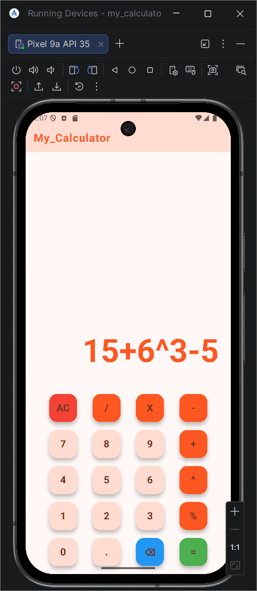

# 📱 Calculator App (Flutter)

Hey 👋  
This is a calculator app I built while learning Flutter.

I tried to design it like a real calculator (not just basic buttons), and also worked on handling different operations properly.

---

## 🚀 What I’ve implemented

- Basic operations: +  -  ×  ÷
- Power operator ^
- Percentage % (with proper calculator logic)
- Backspace (⌫) with smart behavior
- Clear (AC)
- Custom calculator layout (not default boring grid)
- Used expressions to calculate

---

## 🧠 What I learned

- Flutter UI (Grid + custom layout)
- State management using setState
- Handling edge cases in logic (this part was tricky 😅)
- How real calculators actually work internally
- Debugging weird bugs (especially _shouldReset 😵)

---

## 🛠 Tech Used

- Flutter
- Dart

---

## ⚠️ Still working on

- Better UI animations
- History feature
- Different types of calculator works

---

## 💭 Why I made this

I wanted to build something more than just a basic app and understand:

- how UI + logic connects
- how real apps handle user input
- how to calculate a given expression

---

## 📸 Screenshots

---

## 🙃 Note

I’m still learning, so the code might not be perfect.  
If you have suggestions, feel free to share!

## 📦 Download APK

👉 [Click here to download the app](https://github.com/RahulSahana/my_calculator/releases/download/v2.0.0/calculator-app-v2.0.0.apk)

