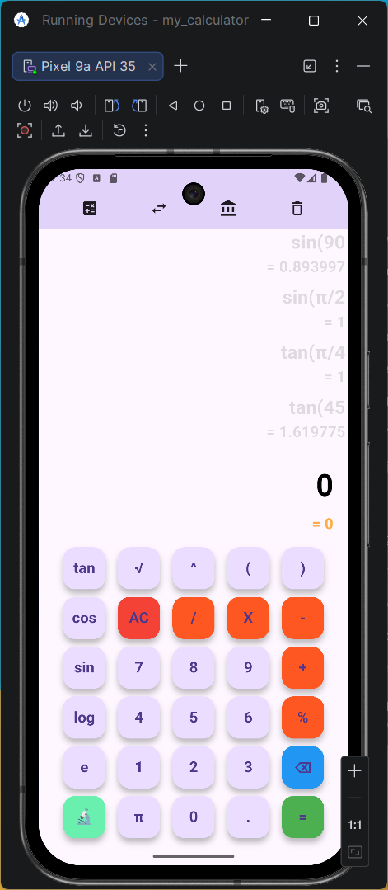

# 📱 🚀 Multi-Utility Calculator App (Flutter)

Hey 👋  
This is a multi-utility calculator app I built using Flutter while exploring both **UI design and real-world calculation logic**.

What started as a simple calculator has now evolved into a **feature-rich utility app with multiple modules**.

---

## 🚀 Features

### 🧮 Standard Calculator
- Basic operations: +  −  ×  ÷
- Power operator ( ^ )
- Percentage (%) with real calculator logic
- Full expression evaluation (BODMAS supported)
- Backspace (⌫) with smart handling
- Clear (AC)
- Dynamic expression display
- Proper result handling after `=` (no incorrect chaining)

---

### 📊 Conversion Module
- Clean grid-based UI for multiple converters

Includes:
- Length
- Mass
- Temperature
- Time
- Data
- Area
- Volume
- And more...

Custom conversion screen features:
- Unit selection (dropdown-style)
- Live value updates
- Custom numpad input

---

### 🕘 History Feature
- Stores previous calculations
- Scrollable history view
- Clean and minimal UI

---

## 🧠 What I Learned

- Building **custom UI layouts** instead of default widgets
- Managing state using `setState` efficiently
- Handling **expression parsing & evaluation**
- Implementing **multi-page navigation (Navigator)**
- Structuring a Flutter app into **modular components**
- Handling real-world edge cases in user input
- Designing UI similar to real apps (not tutorial-style)

---

## 🛠 Tech Stack

- Flutter
- Dart

---

## ⚠️ Work in Progress

- More converters (Finance, advanced tools)
- UI animations & transitions
- Data persistence (saving history permanently)
- Theme customization

---

## 💭 Motivation

I built this project to go beyond basic apps and understand:

- How UI and logic interact in real applications
- How calculators actually process expressions
- How to design a scalable Flutter app structure

---

## 📸 Screenshots

> Add your latest screenshots here

---

## 📦 Download APK

👉 [Download v3.0.0](https://github.com/RahulSahana/my_calculator/releases/download/v3.0.0/calculator-app-v3.0.0.apk)

---

## 🙃 Note

I’m continuously improving this project as I learn more.  
If you have suggestions or ideas, feel free to share!